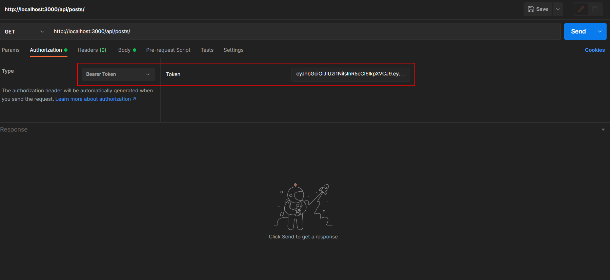
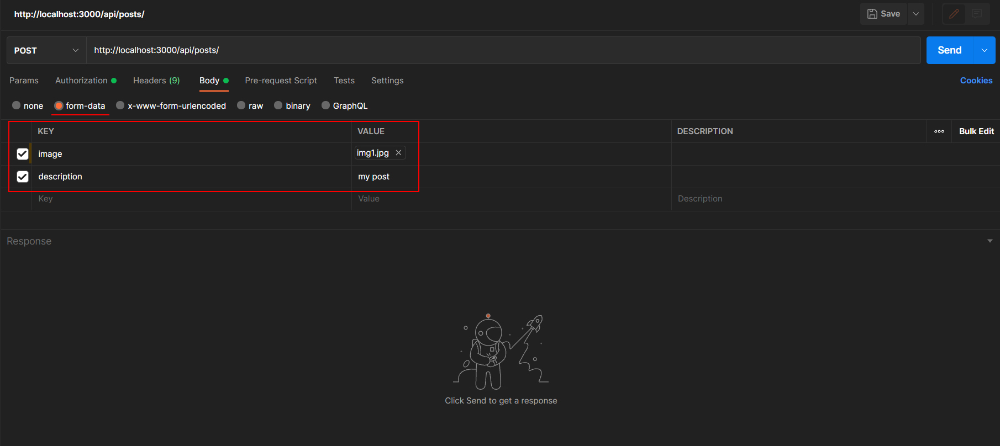

<div align="center">
  <h1>Instagram API clone</h1>
</div>

<div align="justify">

   This project is an API application developed as a clone of the popular social platform Instagram. It provides a range of functionality that allows users to interact with posts, users, and comments. The application is developed using **Node.js**, **Express.js**, **MongoDB**, **JWT** *(JSON Web Tokens)*, etc.

   📝 Here is an overview of the main features and principles of the application:

   1. Authentication and authorization:  
      *• Users can register by creating accounts with unique identifiers  
      • Registered users can log in using their credentials  
      • Upon successful authentication, users receive an access token that is used to authorize requests*  

   2. Users:  
      *• Only public information about Users is available for viewing  
      • Users can edit their account information as well as delete their account  
      • Each user has a unique ID, username, email address and password*  
   
   3. Posts:  
      *• Users can create new posts including images and descriptions  
      • Each post is associated with a specific user and contains a unique ID, image, description, and creation date  
      • Users can only edit or delete their own posts  
      • Users can view publications, both their own and other users publications*  

   4. Comments:  
      *• Users can add comments to posts  
      • Each comment is associated with a specific post and the user who wrote it  
      • Users can only edit or delete their own comments  
      • Users can view comments on posts and reply to them* 

   5. Pagination:  
      *• Lists of Users, Posts, and Comments are paginated for easy navigation and query efficiency  
      • Users can receive data in chunks by specifying the page number or data chunk size in the request*  

   6. Uploading images:  
      *• Users can upload images to their publications  
      • Uploaded images are stored on the server and linked to the respective publication  
      • For the uploaded image, a link is formed by which it will be available*  

   7. Route protection:  
      *• Some routes require authentication and authorization to restrict access to registered users only  
      • Middleware functions are used to validate the access token and allow or deny access*  

   8. Error Handling:  
      *• In case of errors such as invalid route, server error, or insufficient authorization, the API returns appropriate error messages with appropriate statuses*
      
</div>

<br>

<div align="center">

   # Settings

</div>

<div align="left">

1. Clone this repository

```
   git clone https://github.com/lazycatcoder/instagram-api-clone.git
```


2. Install **Node.js**
   
**Node.js** and **npm** (Node Package Manager) should be installed on your system. You can download them from the official Node.js website: *https://nodejs.org*

3. Install **MongoDB** 

- Install **MongoDB Compass** from official website: *https://www.mongodb.com/*  
- After installation **MongoDB Compass** create the **mydatabase** database on *localhost:27017*.  
- In the **mydatabase** create 3 collections: *Users*, *Posts*, *Comments*.  
- For each collection, import test data from the corresponding JSON files in the ***'instagram-api-clone\test_data'*** folder.

4. Install Dependencies

Open a terminal or command prompt, navigate to the extracted/cloned repository folder. Run the following command to install the required dependencies listed in the **package.json** file:

```
   npm install
```

5. Start the Server 🚀

In the same terminal or command prompt, navigate to the repository folder.
Run the following command to start the server:

```
   nodemon app.js
```
The server should now be running and listening for requests on the specified port *(default is port 3000)*.

6. Application testing

Download Postman from *https://www.postman.com/* if you don't have it installed.  

⚡Launch Postman and check the following application routes:

## 🔹Authentication and Registration 

| Route            |  HTTP  | AUTH body (raw JSON)                                         | Auth | Description  |
| ---------------- | ------ | ------------------------------------------------------------ | ---- | ------------ |
| /api/auth/signup | `POST` | { "username": "username4", "email": "example4@example.com", "password": "password4", "confirmPassword": "password4" } |  -  |  Signup |
| /api/auth/login  | `POST` | { "email": "example1@example.com", "password": "password1" } |  -   | Login        |
| /api/auth/logout | `POST` | { "_id": "64aab44e21b75abc2d297eb3" }                        |  +   | Logout       |

<br>

🚩 *using the test file **mydatabase.users.json** you can also login as a different user.* 
- user 1:
```
   { "email": "example1@example.com", "password": "password1" }
```
- user 2:
```
   { "email": "example2@example.com", "password": "password2" }
```
- user 3:
```
   { "email": "example3@example.com", "password": "password3" }
```
<br>

<div align="justify">

⚠️ *when you test this API in **Postman**, for requests where Authentication is required ("+"), in the "Authorization" (or "Headers") section, you must add the Token that was generated when the User logged into the system.*

<p align="center">
  
  <br>
</p>

</div>

<br>

## 🔹Users 

| Route            |   HTTP   | USER body (raw JSON)                    | Auth | Description                                              |
| ---------------- | -------- | --------------------------------------- | ---- | -------------------------------------------------------- |
| /api/users       | `GET`    | Empty                                   |  -   | Get all users                                            |
| /api/users/:id   | `GET`    | Empty                                   |  -   | Get information about a specific user by ID              |
| /api/users/:id   | `PUT`    | { "email": "example11@example.com" }    |  +   | Update user information (only available for own account) |
| /api/users/:id   | `DELETE` | Empty                                   |  +   | Delete user data by ID (deletes all posts and comments of the user) (only available for own account) |

<br>

🚩 *in the **"Get all users"** route, pagination can be used (displaying no more than 10 entries per page), to go to the next page, you need to change the page number at the end of the link **"/api/users?page=1"**.*

<br>

## 🔹Posts 

| Route                   |   HTTP   | POST body (raw JSON)                                  | Auth | Description                                      |
| ----------------------- | -------- | ----------------------------------------------------- | ---- | ------------------------------------------------ |
| /api/posts              | `GET`    | Empty                                                 |  -   |  Get all posts                                   |
| /api/posts              | `POST`   | Use "form-data": { "KEY": "image", "VALUE": "your image" }, { KEY": "description", "VALUE": "your text" } |  +  |  Create new post |
| /api/posts/user/:userId | `GET`    | Empty                                                 |  -   |  Get all posts of a specific user                |
| /api/posts/:postId      | `GET`    | Empty                                                 |  -   |  Get post by id                                  |
| /api/posts/:postId      | `PUT`    | { "description": "my new post" }                      |  +   |  Update post by id (only available for own post) |
| /api/posts/:postId      | `DELETE` | Empty                                                 |  +   |  Delete post by id (deletes all comments associated with the post) (only available for own post) |

<br>

🚩 *in the **"Get all posts"** and **"Get all posts of a specific user"** routes, pagination can be used (displaying no more than 10 entries per page), to go to the next page, you need to change the page number at the end of the link **"/api/posts?page=1"** and **"/api/posts/user/:userId?page=1"**.*

🚩 *for the **"Create new post"** route, in **Postman** in the "Body" section select the **"form-data"** option. Next, in "KEY" enter "image" (field type File), in "VALUE" you need to upload a JPG image file (you can also add a field **Description**, "KEY": "description", "VALUE": "your text").*

<p align="center">
  
  <br>
</p>

<br>

## 🔹Comments

| Route                      |   HTTP   | COMMENT body (raw JSON)                 | Auth | Description                                            |
| -------------------------- | -------- | --------------------------------------- | ---- | ------------------------------------------------------ |
| /api/comments              | `GET`    | Empty                                   |  -   |  Get all comments                                      |
| /api/comments              | `POST`   | { "postId": "64a9f43464c1c1d460f91e7a", "text": "my comment" } |  +  | Create a new comment             |
| /api/comments/user/:userId | `GET`    | Empty                                   |  -   |  Get all comments of a specific user                   |
| /api/comments/post/:postId | `GET`    | Empty                                   |  -   |  Get all comments on a specific post                   |
| /api/comments/:commentId   | `GET`    | Empty                                   |  -   |  Get comment by id                                     |
| /api/comments/:commentId   | `PUT`    | { "text": "new comment" }               |  +   |  Update comment by id (only available for own comment) |
| /api/comments/:commentId   | `DELETE` | Empty                                   |  +   |  Delete comment by id (only available for own comment) |

<br>

🚩 *in the **"Get all comments"** and **"Get all comments of a specific user"** routes, pagination can be used (displaying no more than 10 entries per page), to go to the next page, you need to change the page number at the end of the link **"/api/comments?page=1"** and **"/api/comments/user/:userId?page=1"**.*

</div>

<br><br><br>

--------------------

<div align="justify">

   🔴 *This application implements partial and exemplary functionality and does not represent a complete and exact implementation of the original Instagram social network API. It is intended to demonstrate the typical features and concepts involved in building such a social platform. The actual API and functionality of the original Instagram app may vary in implementation, scope, and detail. This description is only a guideline for understanding the general features that can be expected from this type of social network. When developing a real application, you should take into account the original specification and requirements for the API and functionality of the Instagram social network.*  

</div>